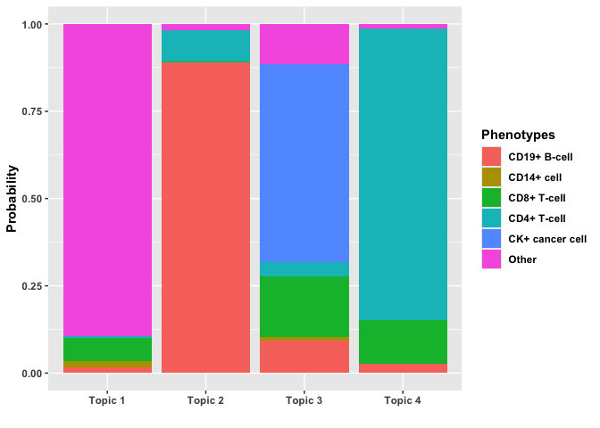
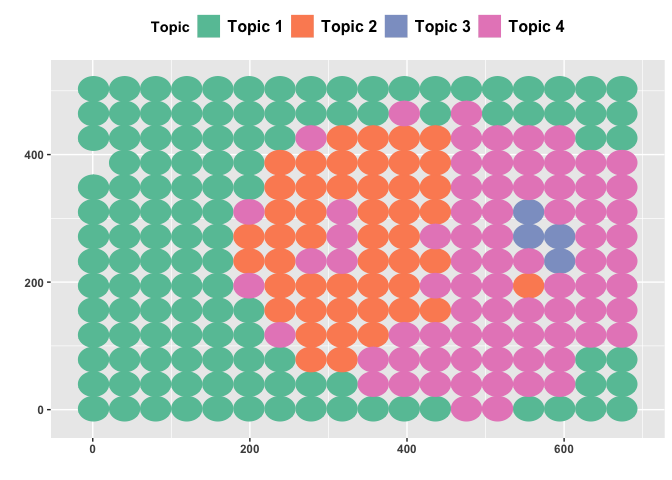
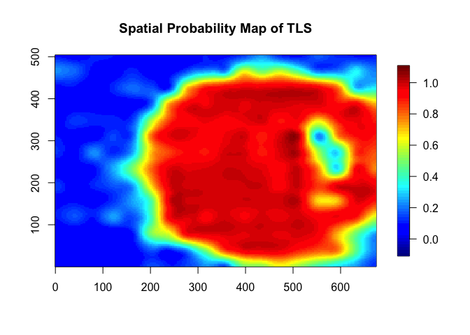

TopSpace: spatial topic modeling for unsupervised discovery of
multicellular spatial tissue structures in multiplex imaging
================

- [Installation](#installation)
- [Example](#example)
  - [Estimated topics](#estimated-topics)
  - [Spatial clustering](#spatial-clustering)
  - [Spatial probability map of TLS](#spatial-probability-map-of-tls)

The R package `TopSpace` implements an efficient Markov chain Monte
Carlo algorithm for TopSpace, a novel Bayesian spatial topic model for
unsupervised discovery of multicellular spatial tissue structures in
multiplex imaging.

## Installation

To install the latest version of the R package `TopSpace` from Github,
use

``` r
library(devtools)
devtools::install_github("junsoukchoi/TopSpace")
```

## Example

The following example demonstrates how to use the `TopSpace` package to
identify multicellular spatial tissue structures from multiplex imaging
data. We use the `NSCLC` dataset, a pre-processed dataset containing
multiplex immunohistochemistry imaging data from tissue sections of 153
patients with non-small cell lung cancer. The `mcmc.TopSpace` function
takes a multiplex tissue image along with the required MCMC parameters
and returns MCMC samples from the posterior distributions of the
TopSpace model. The MCMC procedure is initialized using the
`init.mcmc.TopSpace` function by leveraging the standard LDA approach.

``` r
library(TopSpace)
library(ggplot2)
library(ggforce)
library(MBA)
library(fields)
```

    ## Loading required package: spam

    ## Spam version 2.10-0 (2023-10-23) is loaded.
    ## Type 'help( Spam)' or 'demo( spam)' for a short introduction 
    ## and overview of this package.
    ## Help for individual functions is also obtained by adding the
    ## suffix '.spam' to the function name, e.g. 'help( chol.spam)'.

    ## 
    ## Attaching package: 'spam'

    ## The following objects are masked from 'package:base':
    ## 
    ##     backsolve, forwardsolve

    ## Loading required package: viridisLite

    ## 
    ## Try help(fields) to get started.

``` r
# set random seed
set.seed(2024)

# load the pre-processed non-small cell lung cancer (NSCLC) dataset
data("NSCLC")

# select the image of the second patient
img = 2
X = NSCLC[[img]]$X
nbd_sizes = NSCLC[[img]]$nbd.sizes
coord = NSCLC[[img]]$coord


### fit our proposed TopSpace to the selected image ###
# will choose the optimal number of topics K among {2, 3, 4, 5}
DIC   = rep(NA, 4)
K_eff = rep(NA, 4)
TIME  = rep(NA, 4)
out   = list()
for (K in 2 : 5)
{
   # number of cell types: CD19+ B-cells, CD14+ cells, CD8+ T-cells, CD4+ T-cells, CK+ cancer cells, and Others
   H = 6
   
   # initialize MCMC for TopSpace using the standard LDA
   init   = init.mcmc.TopSpace(X, nbd_sizes, H, K, coord, kernel.params =  c(0.01, 1))
   priors = list(gamma = rep(0.5, H))
   
   # run MCMC for the proposed TopSpace, with the specified K
   p_time = proc.time()
   out_GPSTM  = mcmc.TopSpace(X, nbd_sizes, H, K, init, priors, n.mcmc = 20000, n.burnin = 10000)
   time_GPSTM = proc.time() - p_time
   
   # store the deviance information criterion (DIC), effective number of topics K, and runtime
   DIC[K - 1]   = out_GPSTM$DIC
   K_eff[K - 1] = out_GPSTM$K.eff
   TIME[K - 1]  = time_GPSTM[3]
   
   # summarize posterior samples: compute posterior means for Z, beta, and alpha
   Z_ppm = matrix(NA, sum(nbd_sizes), K)
   for (k in 1 : K)
   {
      Z_ppm[ , k] = rowMeans(out_GPSTM$Z == k)
   }
   
   Z_est = apply(Z_ppm, 1, which.max)
   Z_est_list = list()
   Z_est_list[[1]] = Z_est[1 : nbd_sizes[1]]
   for (i in 2 : length(X))
   {
      Z_est_list[[i]] = Z_est[sum(nbd_sizes[1 : (i - 1)]) + (1 : nbd_sizes[i])]
   }
   
   beta_est = apply(out_GPSTM$beta, c(1, 2), mean)
   
   alpha_est = apply(out_GPSTM$alpha, c(1, 2), mean)
   
   # find the dominant topic for each neighborhood by selecting the highest topic probability
   nbd_topic_est = apply(alpha_est, 1, which.max)
   
   # store the posterior inference results
   out[[K - 1]] = list()
   out[[K - 1]]$Z = Z_est_list
   out[[K - 1]]$beta = beta_est
   out[[K - 1]]$alpha = alpha_est
   out[[K - 1]]$nbd_topic = nbd_topic_est
}

# choose the optimal K based on the DIC, and obtain the corresponding results
result = list()
result$dat = X
result$coord = coord
result$nbd.sizes = nbd_sizes
opt = which.min(DIC)
result$K    = K_eff[opt]
result$DIC  = DIC[opt]
result$TIME = TIME
result$est  = out[[opt]]
```

Here, the TopSpace results are illustrated: the estimated topics,
spatial clustering based on dominant topics, and the spatial probability
map of tertiary lymphoid structure (TLS).

### Estimated topics

``` r
# illustrate topics (beta), i.e., per-topic cell type distribution
x = paste("Topic", 1 : result$K)
y = c("CD19+ B-cell", "CD14+ cell", "CD8+ T-cell", "CD4+ T-cell", "CK+ cancer cell","Other")
df_beta = expand.grid(Topics = x, Phenotypes = y)
df_beta$beta = c(result$est$beta)
ggplot(data=df_beta, aes(x=Topics, y=beta, fill=Phenotypes)) + geom_bar(stat="identity", position = position_fill(reverse = TRUE)) + 
   xlab("") + ylab("Probability") +
   theme(legend.title = element_text(face = "bold"), legend.text = element_text(face = "bold"), 
         axis.title.x = element_text(face = "bold"), axis.title.y = element_text(face = "bold"), 
         axis.text.x = element_text(face = "bold"), axis.text.y = element_text(face = "bold"))
```

<!-- -->

### Spatial clustering

``` r
# illustrate spatial clustering defined by the dominant topics
df_clustering = data.frame(x = result$coord[ , 1], y = result$coord[ , 2], r = rep(19, nrow(result$coord)), 
                           Topic = factor(paste("Topic", apply(result$est$alpha, 1, which.max))))
ggplot(df_clustering, aes(x0 = x, y0 = y, r = r, color = Topic, fill = Topic)) + geom_circle() + scale_fill_brewer(palette = "Set2") +
   scale_color_brewer(palette = "Set2") + xlab("") + ylab("") + 
   theme(legend.title = element_text(face = "bold"), legend.position="top", legend.text = element_text(size = 12, face = "bold"),
         axis.title.x = element_text(face = "bold"), axis.title.y = element_text(face = "bold"), 
         axis.text.x = element_text(face = "bold"), axis.text.y = element_text(face = "bold"))
```

<!-- -->

### Spatial probability map of TLS

``` r
# generatea spatial probability map for tertiary lymphoid structures (TLS)
result$cl_Bcells = which(result$est$beta[ , 1] > 0.5) 
result$cl_Tcells = which(result$est$beta[ , 3] + result$est$beta[ , 4] > 0.5) 
surf = mba.surf(cbind(result$coord, data = rowSums(result$est$alpha[ , c(result$cl_Bcells, result$cl_Tcells)])), 
                no.X = 200, no.Y = 200)$xyz.est
image.plot(surf, xlab = "", ylab ="", zlim = c(-0.1, 1.1), legend.mar = 6, main = "Spatial Probability Map of TLS")
```

<!-- -->
